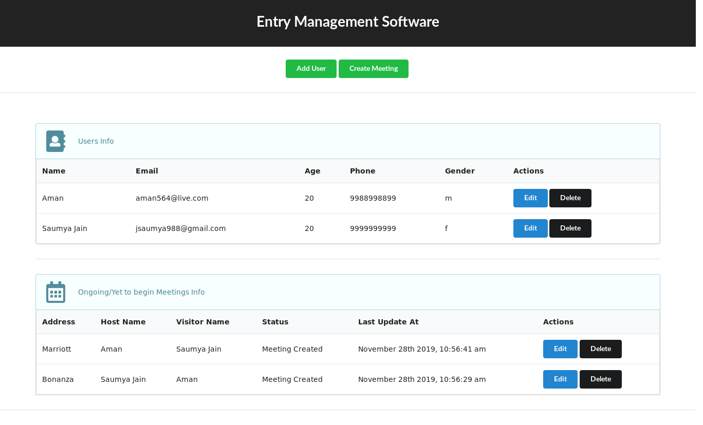
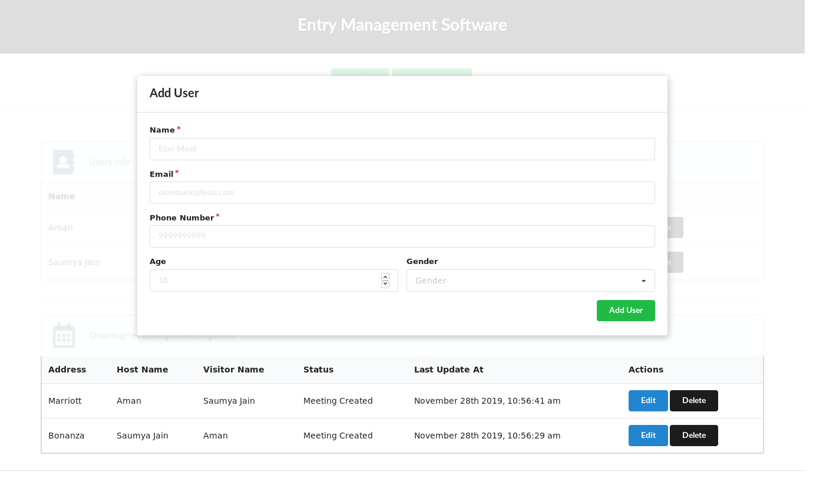
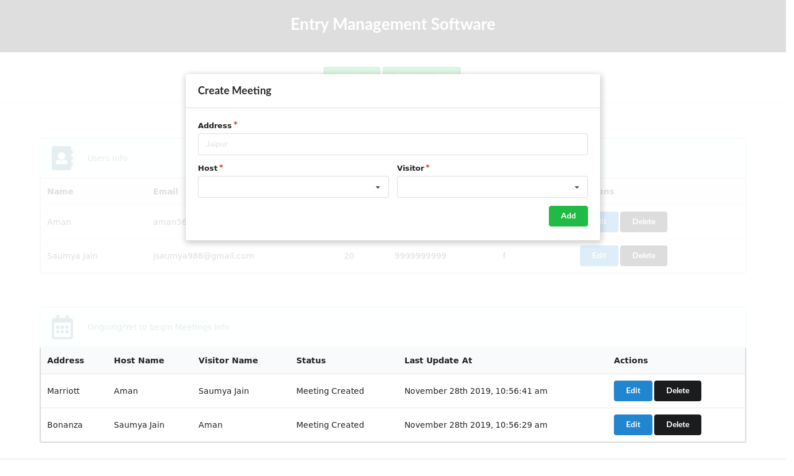
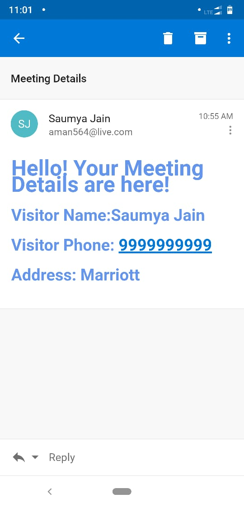
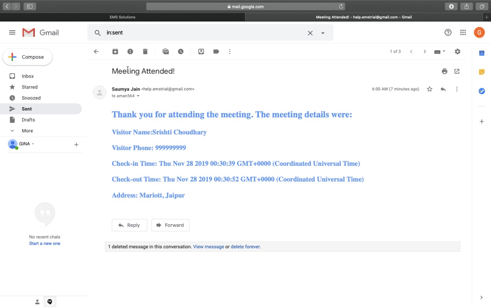
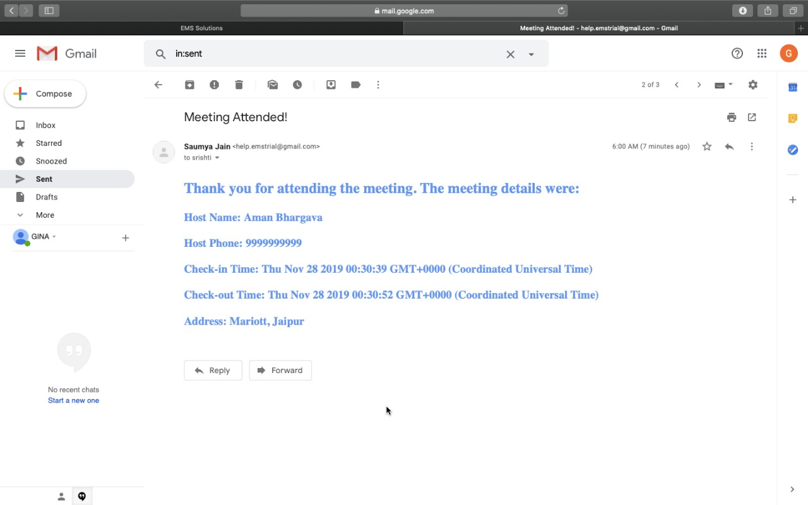

# Entry Management Software

A simple records system using MongoDB, Express.js, React.js, and Node.js with real-time Create, Read, Update, and Delete operations using Socket.io. REST API was implemented on the back-end. Semantic UI React was used for the UI.


# DEMO VIDEO
https://youtu.be/t4WWhlt7ks4

# Screenshots







# About
Entry Management Software which uses  Dockerized CRUD API and React Front-end to manage Users and their corresponding Meetings. 

We use MongoDB as our database and interact with it using Mongoose. 

We use Express to manage our server and handle requests and responses. 

Emails are sent using SMTP auth from the nodemailer package. Emails are sent when a meeting is created, and when it is completed.

This application is containerized, highly scalable and handles the typical business use case very well.

For the **back-end**, install the dependencies once via the terminal.
```bash
npm install
```

To make a production build, simply run on *react-src* folder via the terminal.
```bash
npm run build
```

It re-creates a folder named *public* on the root directory. This is where the production-ready front-end of the web application resides.

## Docker
```bash
docker-compose up
```

## Docker Rebuild
```bash
docker-compose up -d --build --force-recreate
```
# Usage
```bash
docker-compose up
```

# Roadmap
* Hassle-free Check-in process: Easily set up meetings, update the status
* Notifications: When a visitor arrives at the office, the visitor management system sends an automatic notification to the person, the visitor is there to see via email.
* Digital Visitor Log: Creates a database of all the meetings scheduled
* Events: Capture accurate and legible contact details, making it a breeze to follow up with event attendees
* Approval based Entry: Restrict access to your premises with Invite only mode. The walk-in visitor is provided with an option to request a meeting with the host. 
* Check out: Visitors can check-out on the web or admins can check them out via web dashboard

# Future Scope
* Mobile app for Check-in:- 
  Quicker check-in with mobile app. (Useful for frequent visitors)
* VIP Check-in:-
Manually create visitor entries right from the dashboard for VIPs to skip the scans
* Check out:-
  Visitors can check-out on iPad or admins can check them out via web dashboard
* Meeting Room Display:- 
Display real-time availability & occupancy status by syncing the app with your existing calendars

# To Do

- [x] Create
- [x] Read
- [x] Check E-mail
- [x] Update
- [x] Delete

# License
* [MIT](LICENSE)
